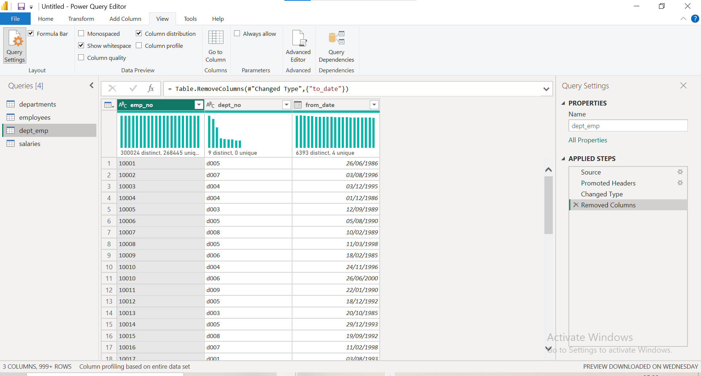
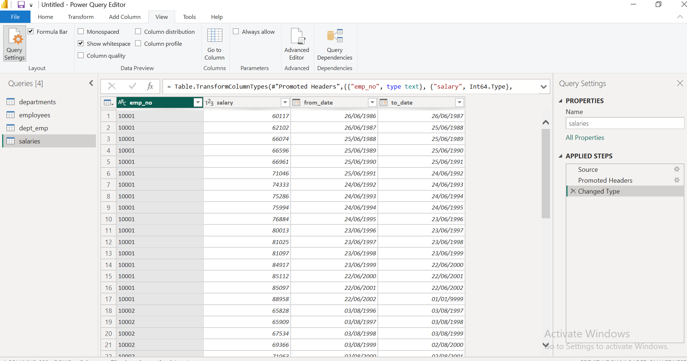
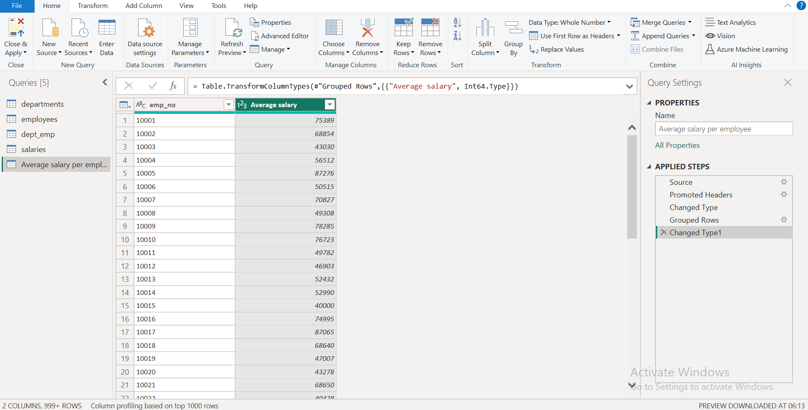
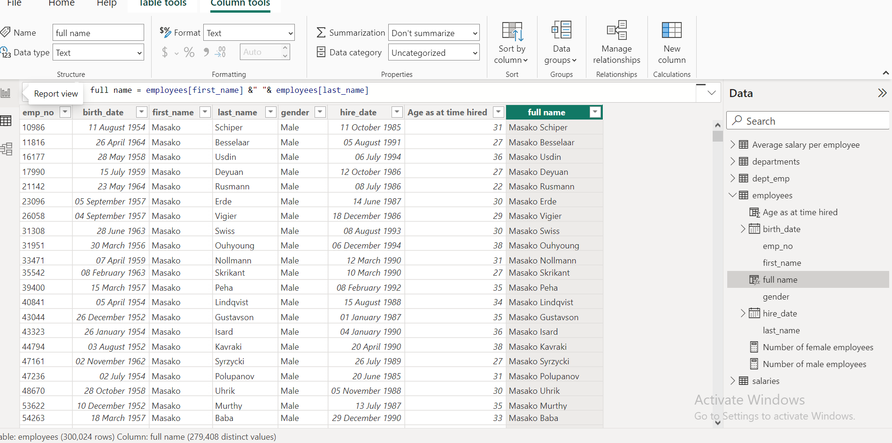
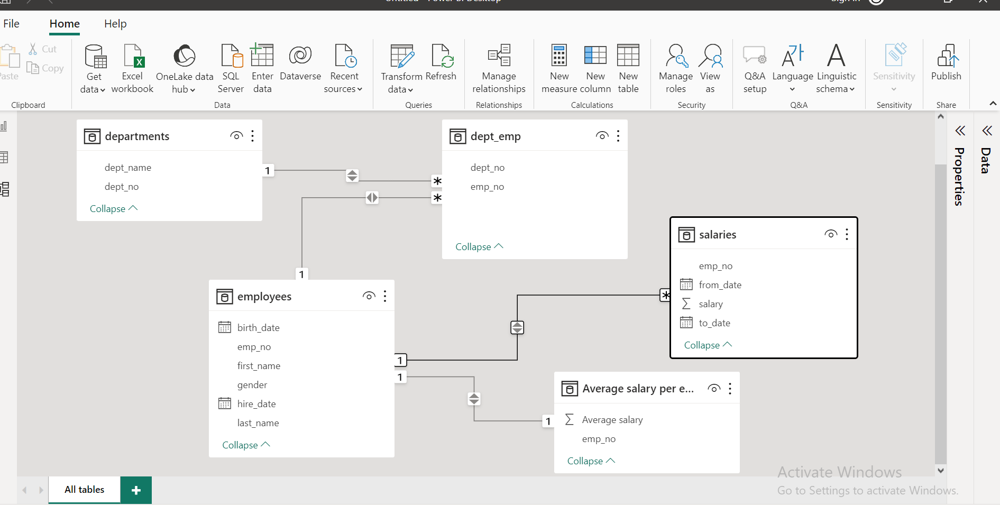
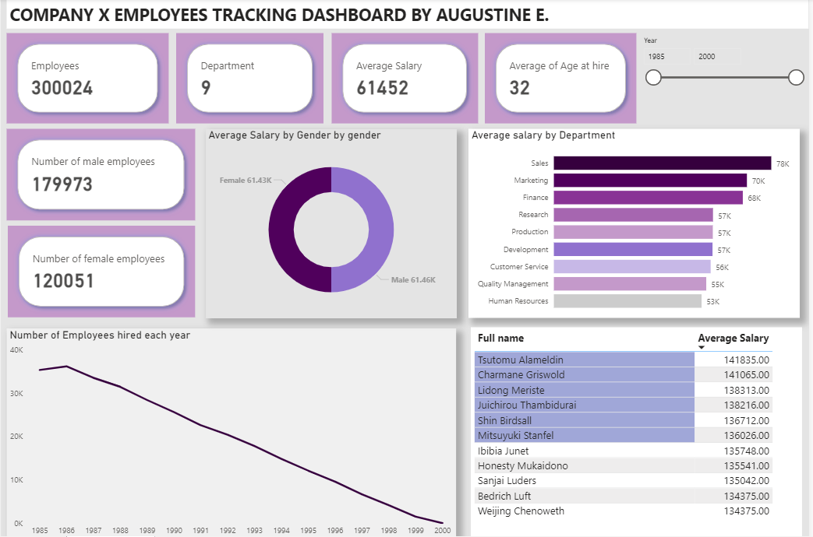

# EMPLOYEES-DATASET

I had the opportunity to work on a huge employees dataset that consist of four different tables, in which i cleaned, analyzed generated in insights and cardinality, then created a dashboard to show trends and meaningful information on how the company performed and how to move forward.

---

##### About the dataset
 The four dataset include
 * department
 * salary
 * employees
 * dept emp

 Tool used: Microsoft power bi.

 ---
 
###### steps

1.  #####  Data Cleaning and Transformation
i started my analysis by downloading the datasets in microsoft power bi, then proceeded in transferring them into power query editor for cleaning, i changed and adjusted them into their proper data type and category, then also checked the column profiling, column quality and column distribution of each column of the tables, also checked for duplicate values and errors. i changed the datatype of the emp no. and dept no. column into text, because its a column that we are not aggregating.

           

Then while working on the salary table i observed that many of the employees worked in different department in different years therefore showing different salaries from different years and department. i proceeded by using the GROUP BY function to categorize and group them. after grouping and using the average function to find their average salaries.

 

i also created a new column of fullname, joining the first name and the last name

 

---

2. ##### Data Modelling

   Relationship was created between the tables, Then i had to check to apply the cross filter direction, so as to enable filtering from both tables. The unique keys in each dataset were used to connect to a different dataset while building the relationship.
   
---
3. ##### Data Analysis
   i created a few KPIs to help in my analysis, i also created different measures( used the calculate function to find out the division into males and females in the employees table).
   i concluded by created a  tracking dashbord to showing the trends, to show how much the average salary each employees earned and the other key metrics derived from the analysis. i created and attached a slicer to filter through the hire date. i also used the donut chart to visualize the average salary by gender, a clustered bar chart to show the average salary by department, and a table showing the top ten employees and thier average salary, all included in the dashboard i created.

   

   ---

